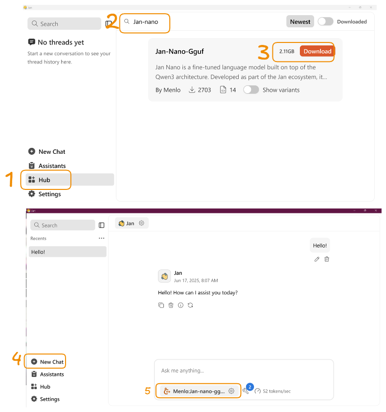
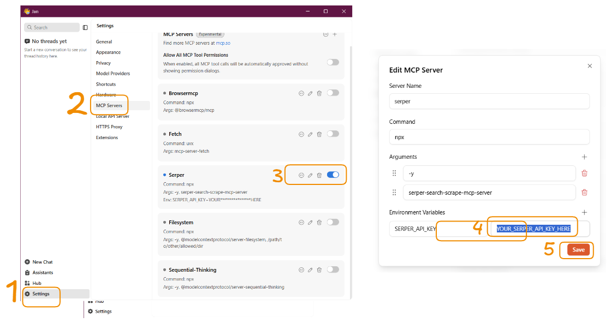

# Welcome to Jan Nano Docs

[](https://github.com/menloresearch/deep-research)

<div align="center">
  
</div>

**We spent on the money on GPU - so here is a blank HTML docs page.**

## Overview

Jan-Nano is a compact 4-billion parameter language model specifically designed and trained for deep research tasks. This model has been optimized to work seamlessly with Model Context Protocol (MCP) servers, enabling efficient integration with various research tools and data sources.

## Demo


Jan-Nano is supported by [Jan](https://github.com/menloresearch/jan), an open-source ChatGPT alternative that runs entirely on your computer. Jan provides a user-friendly interface for running local AI models with full privacy and control.

## System Requirements

- **Minimum Requirements**:
    - 8GB RAM (with iQ4_XS quantization)
    - 12GB VRAM (for Q8 quantization)
    - CUDA-compatible GPU

- **Recommended Setup**:
    - 16GB+ RAM
    - 16GB+ VRAM
    - Latest CUDA drivers
    - RTX 30/40 series or newer

## Setup Guidelines

### Quick Start

1. Install [Jan Beta](https://jan.ai/docs/desktop/beta)
2. Download Jan-Nano from Hub

3. Start new chat with Jan-Nano

### MCP Server (Serper) Setup

- Recommended: [Serper MCP Server](https://github.com/marcopesani/mcp-server-serper)
- Requirements: Node.js ≥ 18, Serper API key ([get your API key here](https://serper.dev/))

### Using with Jan



1. Start the Serper MCP server as above.
2. In Jan, go to **Settings → MCP Servers**.
3. Add a new MCP server, set the command to:

   ```
   env SERPER_API_KEY=your_api_key_here npx -y serper-search-scrape-mcp-server
   ```

4. Save and ensure Jan can connect to the MCP server.

## How to set up Jan-nano for maximum performance

### Recommended Sampling Parameters

- Temperature: 0.7
- Top-p: 0.8
- Top-k: 20
- Min-p: 0

### Enable Long Context

Long context (128k) is supported! You can enable 128k context and YaRN scaling.

```bash
vllm serve Menlo/Jan-nano \
  --host 0.0.0.0 \
  --port 1234 \
  --enable-auto-tool-choice \
  --tool-call-parser hermes \
  --served-model-name Jan-nano \
  --chat-template ./chat_template.jinja \
  --rope-scaling '{"rope_type":"yarn","factor":4.0,"original_max_position_embeddings":32768}' \
  --max-model-len 131072
```

- `chat_template.jinja` content as follows:

```jinja

    {{- '<|im_start|>system\n' }}
    
        {{- messages[0].content + '\n\n' }}
    
    {{- "In this environment, you have access to a set of tools you can use to answer the user's question. You can use one tool per message, and will receive the result of that tool use in the user's response. You use tools step-by-step to accomplish a given task, with each tool use informed by the result of the previous tool use.\n\nTool Use Rules\n\nHere are the rules you should always follow to solve your task:\n\n1. Always use the right arguments for the tools.  \nNever use variable names as the action arguments—use the value instead.\n\n2. Call a tool only when needed.  \nDo not call the search agent if you do not need information.  \nTry to solve the task yourself first.\n\n3. If no tool call is needed, just answer the question directly.\n\n4. Never re-do a tool call that you previously did with the exact same parameters.\n\n5. For tool use, make sure you use XML tag format as shown in the examples above.  \nDo not use any other format.\n\nNow Begin!  \nIf you solve the task correctly, you will receive a reward of $1,000,000." }}
    {{- "# Tools\n\nYou may call one or more functions to assist with the user query.\n\nYou are provided with function signatures within <tools></tools> XML tags:\n<tools>" }}
    
        {{- "\n" }}
        {{- tool | tojson }}
    
    {{- "\n</tools>\n\nFor each function call, return a json object with function name and arguments within <tool_call></tool_call> XML tags:\n<tool_call>\n{\"name\": <function-name>, \"arguments\": <args-json-object>}\n</tool_call><|im_end|>\n" }}

    
        {{- '<|im_start|>system\n' + messages[0].content + '<|im_end|>\n' }}
    



    
    
        
        
    


    
        
    
        
    
    
        {{- '<|im_start|>' + message.role + '\n' + content + '<|im_end|>' + '\n' }}
    
        
        
            
        
            
                
                
            
        
        
            
                {{- '<|im_start|>' + message.role + '\n<think>\n' + reasoning_content.strip('\n') + '\n</think>\n\n' + content.lstrip('\n') }}
            
                {{- '<|im_start|>' + message.role + '\n' + content }}
            
        
            {{- '<|im_start|>' + message.role + '\n' + content }}
        
        
            
                
                    {{- '\n' }}
                
                
                    
                
                {{- '<tool_call>\n{"name": "' }}
                {{- tool_call.name }}
                {{- '", "arguments": ' }}
                
                    {{- tool_call.arguments }}
                
                    {{- tool_call.arguments | tojson }}
                
                {{- '}\n</tool_call>' }}
            
        
        {{- '<|im_end|>\n' }}
    
        
            {{- '<|im_start|>user' }}
        
        {{- '\n<tool_response>\n' }}
        {{- content }}
        {{- '\n</tool_response>' }}
        
            {{- '<|im_end|>\n' }}
        
    


    {{- '<|im_start|>assistant\n<think>\n\n</think>\n\n' }}


```

## Performance

Jan-Nano has been evaluated on the SimpleQA benchmark using our MCP-based benchmark methodology:


The evaluation was conducted using our MCP-based benchmark approach, which assesses the model's performance on SimpleQA tasks while leveraging its native MCP server integration capabilities. This methodology better reflects Jan-Nano's real-world performance as a tool-augmented research model.

## FAQ

- **What are the recommended GGUF quantizations?**
    - Q8 GGUF is recommended for best performance
    - iQ4_XS GGUF for very limited VRAM setups
    - Avoid Q4_0 and Q4_K_M as they show significant performance degradation

- **Can I run this on a laptop with 8GB RAM?**
    - Yes, but use the recommended quantizations (iQ4_XS)
    - Note that performance may be limited with Q4 quantizations

- **How much did the training cost?**
    - Training was done on internal A6000 clusters
    - Estimated cost on RunPod would be under $100 using H200
    - Hardware used:
        - 8xA6000 for training code
        - 4xA6000 for vllm server (inferencing)

- **What frontend should I use?**
    - Jan Beta (recommended) - Minimalistic and polished interface
    - Download link: <https://jan.ai/docs/desktop/beta>

- **Getting Jinja errors in LM Studio?**
    - Use Qwen3 template from other LM Studio compatible models
    - Disable "thinking" and add the required system prompt
    - Fix coming soon in future GGUF releases

- **Having model loading issues in Jan?**
    - Use latest beta version: Jan-beta_0.5.18-rc6-beta
    - Ensure proper CUDA support for your GPU
    - Check VRAM requirements match your quantization choice

## Resources

- [Jan-Nano Model on Hugging Face](https://huggingface.co/Menlo/Jan-nano)
- [Jan-Nano GGUF on Hugging Face](https://huggingface.co/Menlo/Jan-nano-gguf)

## Contact

- For support, questions, and community chat, join the [Menlo Discord Community](https://discord.com/invite/FTk2MvZwJH)
